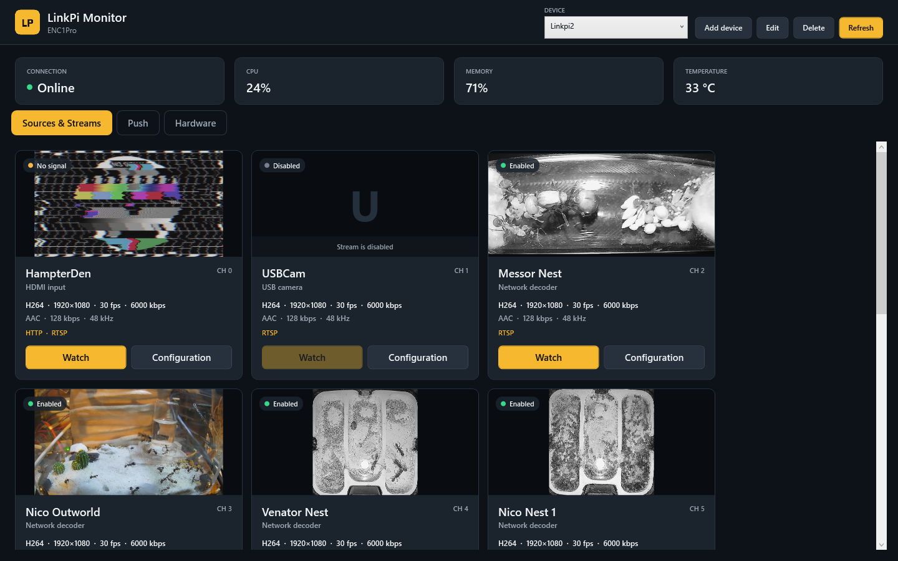
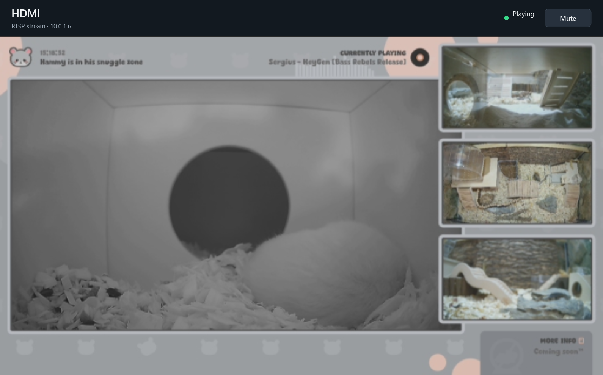
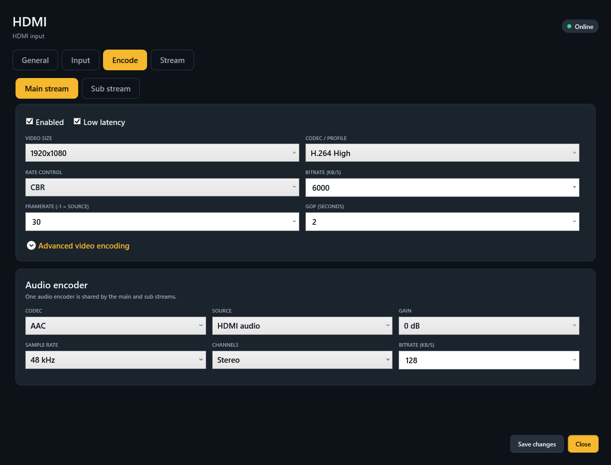
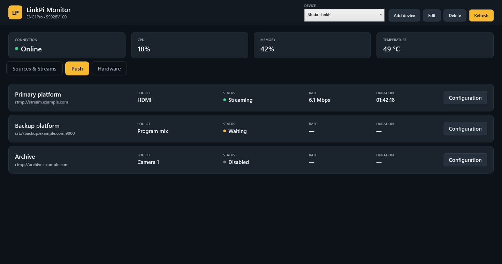
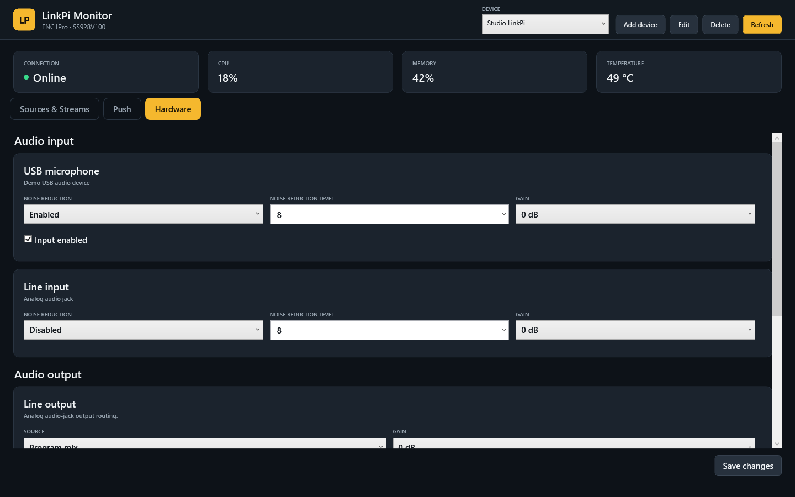

# LinkPi Monitor
[](https://github.com/tomaae/Linkpi-Monitor/releases/latest)


[](https://github.com/tomaae/Linkpi-Monitor/actions/workflows/build.yml)


LinkPi Monitor is a native Windows desktop application for monitoring and configuring LinkPi video encoder/decoder appliances. It combines source health, previews, stream configuration, publishing status, hardware controls, and an embedded live player in one interface.

> [!CAUTION]
> **This project was fully created by AI.** Selected behavior has been tested by the project owner, but the code has not received a comprehensive independent human audit.

Built with C# 14, .NET 10 WPF, and LibVLCSharp.



> [!NOTE]
> The dashboard and Watch screenshots keep the real channel names and camera images. Device usernames, passwords, stream keys, and API keys are not shown; the remaining screenshots use representative configuration values.

## Features

- Manage multiple LinkPi devices and switch between them without restarting the application.
- Display the detected model, CPU use, memory use, temperature, and connection state.
- Discover channel layouts dynamically instead of assuming a fixed four-channel device.
- Present HDMI, USB camera, network decoder, and Mix channels in one dashboard.
- Hide internal File, ColorKey, and Image channels.
- Generate a preview for each active, decodable channel.
- Size previews and the embedded player from the source dimensions, rotation, and crop settings.
- Play advertised RTSP streams inside the application with mute support.
- Configure decode, input, encode, audio, streaming, transport, HLS, NDI, and Push settings.
- Display physical audio input/output and HDMI output controls only when the device reports those capabilities.
- Preserve unknown firmware-specific JSON properties when saving supported settings.

## Interface

### Watch

Watch opens the selected channel's advertised RTSP stream inside LinkPi Monitor. The player follows the effective source proportions after crop and rotation, and includes a local mute control.



### Channel configuration

Each channel has one configuration window. Relevant tabs are selected from the channel type: physical inputs expose Input, network sources expose Decode, and every usable source exposes Encode and Stream.



Configuration includes:

- Channel name and enabled state
- HDMI rotation, crop, contrast, deinterlace, and NTSC compatibility
- USB camera capture size and frame rate
- Network source URL, input frame rate, transport, buffering, decode state, rotation, crop, and contrast
- Main and sub encoder size, codec/profile, rate control, bitrate, frame rate, GOP, latency, QP, and timestamp options
- Shared audio codec, source, gain, sample rate, channels, and bitrate
- Main and sub HTTP, HLS, RTMP, RTSP, SRT, UDP, RIST, WebRTC, and direct-push output settings
- MPEG-TS, HLS segmentation, and NDI settings

Saving asks for confirmation, fetches the latest full configuration from the device, patches the supported fields, and sends the complete document back. This avoids discarding settings introduced by a different firmware version.

### Push destinations

The Push dashboard shows destination state, source, current rate, and session duration without displaying publishing paths or stream keys.



The configuration window supports adding, editing, and removing destinations. Saving Push configuration does not start or stop publishing. LinkPi Monitor does not expose the device network configuration.

### Hardware

The Hardware tab is capability-driven. Depending on the selected model, it can expose USB audio input, analog audio-jack input/output, HDMI output routing, format, rotation, latency, and color controls.



## Requirements

- Windows 10 or later, x64
- .NET 10 SDK for development, or the .NET 10 Desktop Runtime for the published framework-dependent build
- Network access to a supported LinkPi appliance over HTTP or HTTPS
- Valid device login credentials for configuration saves

The published package includes the required x64 LibVLC runtime. VLC does not need to be installed separately.

## Configuration

On first launch, the application creates `config.json` beside the executable. Use **Add device**, **Edit**, and **Delete** in the header to manage the same file from the UI.

```json
{
  "RefreshIntervalSeconds": 5,
  "Devices": [
    {
      "Name": "Studio LinkPi",
      "BaseUrl": "http://192.0.2.10",
      "Username": "your-username",
      "Password": "your-password"
    }
  ]
}
```

`RefreshIntervalSeconds` is clamped to 2–300 seconds. Only the selected device is polled. An empty device list is valid, and the legacy single-`LinkPi` configuration shape remains supported.

> [!IMPORTANT]
> `config.json` stores credentials as plain local JSON. It is excluded from Git and from release packages. Keep the application directory accessible only to trusted users and never commit the real file.

## Run from source

```powershell
dotnet run --project '.\Linkpi Monitor\Linkpi Monitor.csproj'
```

## Tests

```powershell
dotnet test '.\Linkpi Monitor.slnx'
```

The automated save-transport tests use an in-memory HTTP handler and never contact a LinkPi device. They cover channel, Push, and hardware payloads; preservation of unrecognized firmware fields and JSON value types; dynamic Mix-channel discovery; and the guarantee that saving Push configuration does not invoke Push start or stop methods.

## Create a release package

From the repository root:

```powershell
.\Publish.ps1
```

For a non-interactive run:

```powershell
.\Publish.ps1 -NoPause
```

The script restores the solution, runs Release tests, publishes a framework-dependent Windows x64 single-file executable, audits the package contents, and creates:

```text
artifacts/LinkpiMonitor/
artifacts/LinkpiMonitor-win-x64.zip
```

The release package includes `LICENSE`, `THIRD-PARTY-NOTICES.txt`, and the required LibVLC binaries. It never includes `config.json`.

## Device API behavior

LinkPi firmware exposes a mixture of JSON configuration documents, JSON-RPC methods, and authenticated relay calls. LinkPi Monitor currently uses:

- Channel and hardware configuration documents for discovery and supported updates
- Hardware capability metadata for model-specific controls
- System, input, EPG, snapshot, and Push-state calls for monitoring
- The authenticated default-configuration update relay for channel and hardware saves
- `push.update` for Push configuration saves

Monitoring does not invoke update, start, or stop operations. Snapshot failures are isolated per channel so one unavailable source does not fail the entire refresh.

Firmware schemas differ between devices. The application preserves properties it does not understand, retains firmware-specific string/number representations where required, and omits optional fields that the active firmware does not provide. Even so, configuration changes should be tested carefully after adding support for a new model or firmware family.

## Project layout

```text
Linkpi Monitor/          WPF application
Linkpi Monitor.Tests/    Isolated save-transport tests
docs/screenshots/        Sanitized README images
Publish.ps1              Audited Windows x64 packaging script
```

## License

LinkPi Monitor is licensed under the [Apache License 2.0](LICENSE). LibVLCSharp and LibVLC remain under their respective licenses; see [THIRD-PARTY-NOTICES.txt](THIRD-PARTY-NOTICES.txt).
